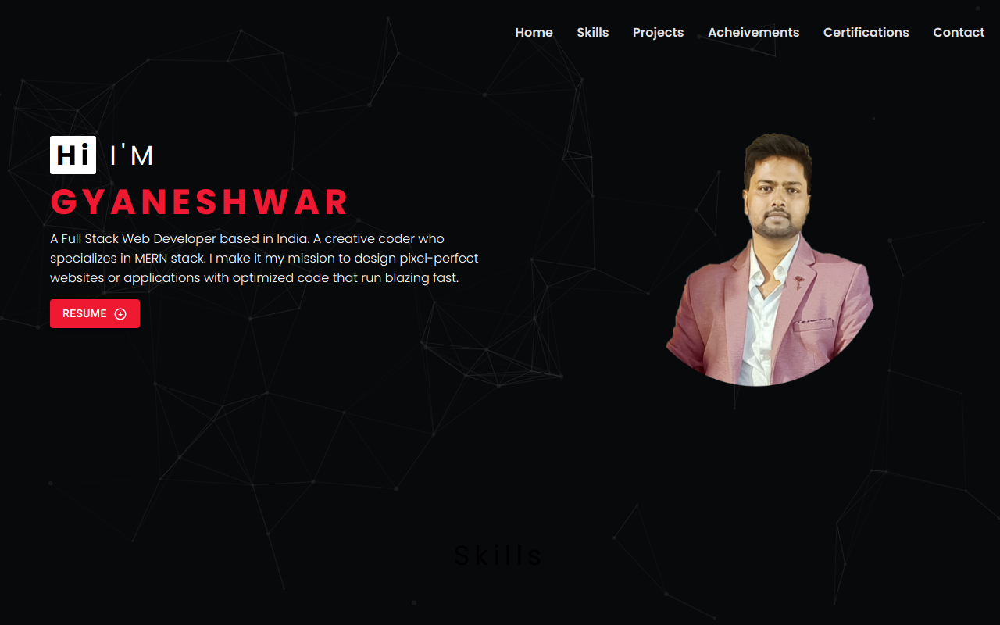

# Portfolio
Buid my own portfolio.  

  
<h3>Teach stack used</h3>
HTML | CSS | JAVASCRIPT | REACT
 

# Feature
<ul>
 <li>Unique Interface with animation</li>
 <li>Full responsive pages</li>
 </ul>
 
    
<h3 align="left">Connect with me:</h3>

